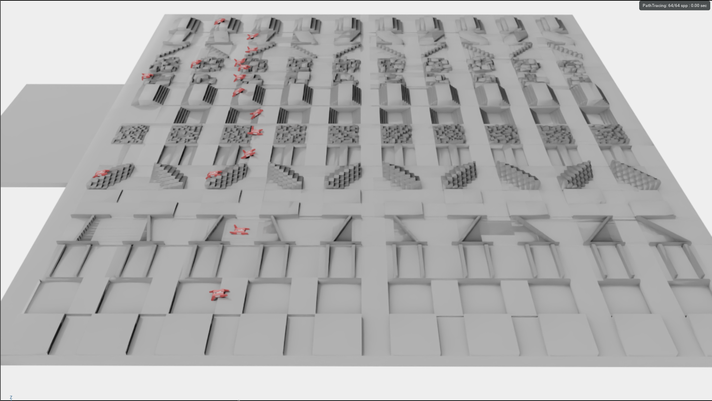
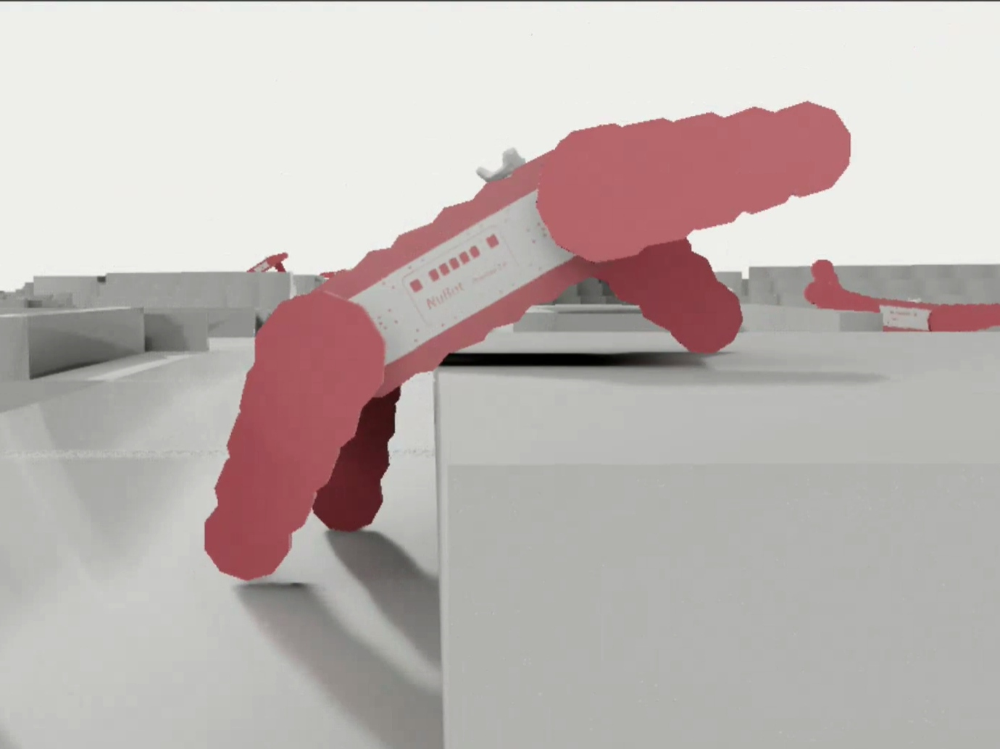
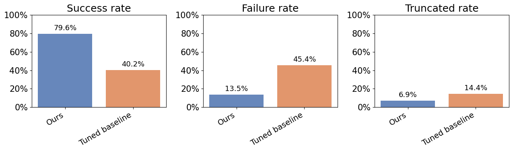

# MARV_RL

Reinforcement learning experiments for autonomous flipper control of the MARV tracked robot, trained in modified [FTR-Bench](github.com/pavelsarga/FTR-Benchmark) rigid-body simulator (IsaacLab / PhysX).

The trained policy controls all four flippers and the robot's velocity simultaneously, enabling autonomous traversal of unstructured terrain without operator input.

---

## Overview

| | |
|---|---|
|  |  |
| Parallel evaluation on the FTR-Bench Mixed terrain | Policy climbing a raised platform obstacle |

**Best policy result — experiments/best_long:**



The RL policy achieves **79.6% success rate** across 16 terrain types, compared to **40.2%** for a optuna-tuned baseline (experiments/random_policy_optuna).

---

## Repository structure

```
configs/        Training and Optuna hyperparameter configs (YAML)
experiments/    Saved policy checkpoints (.pth) and evaluation results
images/         Screenshots and evaluation plots
notebooks/      Analysis notebooks (Optuna, weight evolution, shock distribution, …)
optuna/         Optuna study databases
scripts/        Training, evaluation, and utility shell/Python scripts
slurm/          SLURM batch scripts for HPC cluster jobs
src/
  flipper_training/   Core RL framework (PPO, reward, environment)
  FTR-Benchmark/      FTR-Bench IsaacLab environments (submodule)
```

---

## Setup

The training environment requires an NVIDIA GPU and the `isaaclab` conda environment.

```bash
# Clone with submodules
git clone --recurse-submodules <repo-url>
cd MARV_RL
```

**Option A — conda (local)**
```bash
conda env create -f containers/environment.yml
conda activate isaaclab
```

**Option B — Apptainer/Singularity container (recommended for HPC)**

Build the container from the definition file (requires Apptainer ≥ 1.0):
```bash
apptainer build containers/isaaclab_optuna.sif containers/isaaclab.def
```
This pulls Miniconda, installs the conda environment, and bakes Isaac Lab v1.2.0 from source into the image. Build takes ~10–20 minutes depending on network speed.

Run a command inside the container:
```bash
apptainer exec --nv containers/isaaclab_optuna.sif python src/flipper_training/flipper_training/experiments/ppo/train_ftr.py --config configs/ftr_config_optuna_best_v4.yaml --headless

# Or use scripts that include the apptainer bind
bash scripts/train.sh --config configs/ftr_config_optuna_best_v4.yaml --headless
```
The `--nv` flag passes through the host NVIDIA GPU. On SLURM clusters the SLURM scripts handle this automatically.

Place your Weights & Biases API key in `secrets/wandb.env`:
```bash
echo "WANDB_API_KEY=your_key_here" > secrets/wandb.env
```

---

## Training

```bash
# Local training with the recommended config
CONFIG=ftr_config_optuna_best_v4.yaml bash scripts/train.sh

# Or on a SLURM cluster
sbatch slurm/train_org.sbatch
```

The config file is specified via the `CONFIG` environment variable. All configs live in `configs/`. The recommended starting point is `configs/ftr_config_optuna_best_v4.yaml`.

Training logs and checkpoints are saved to `logs/<run_name>/`. W&B logging is enabled by default.

---

## Hyperparameter search (Optuna)

```bash
# Local Optuna run
bash scripts/run_ftr_training.sh

# SLURM Optuna run
sbatch --array=0-99%10 slurm/optuna_ftr.sbatch
```

The Optuna study database is stored in `optuna/optuna.db`. Analysis notebooks are in `notebooks/optuna_analysis.ipynb`.

---

## Evaluation

```bash
# Evaluate the policy localy
bash scripts/eval.sh experiments/best_long/attempt_0\
    --num_envs 256 --repeats 30\
    --output_dir logs/policy_eval\
    --eval_id best_long --headless # for visualization omit --headless
# Or on SLURM cluster
slurm sbatch/eval_ftr.sbatch experiments/best_long/attempt_0\
    --num_envs 256 --repeats 30\
    --eval_id best_long --headless
```

Results and per-environment heatmaps are saved under `experiments/`.

---

## Key configs

| Config | Description |
|--------|-------------|
| `ftr_config_optuna_best_v4.yaml` | Best config from Optuna study — use this as the starting point |
| `optuna_ftr_smooth.yaml` | Optuna study config |
| `rand_policy_eval.yaml` | Random policy eval config |

---

## Method summary

- **Algorithm:** Proximal Policy Optimization (PPO) with Generalized Advantage Estimation (GAE)
- **Simulator:** FTR-Bench (IsaacLab / NVIDIA PhysX rigid-body)
- **Observations:** 45×21 robot-centric heightmap (processed by a CNN encoder) + linear/angular velocity, flipper positions, pitch/roll, goal vector
- **Actions:** Linear velocity, angular velocity, 4 independent flipper joint velocities
- **Reward:** Multi-component — goal progress, forward motion bonus, flipper action bonus, roll/pitch stability penalties, shock penalty, clearance penalty
