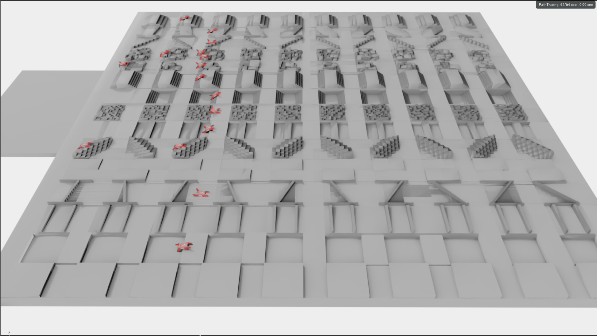
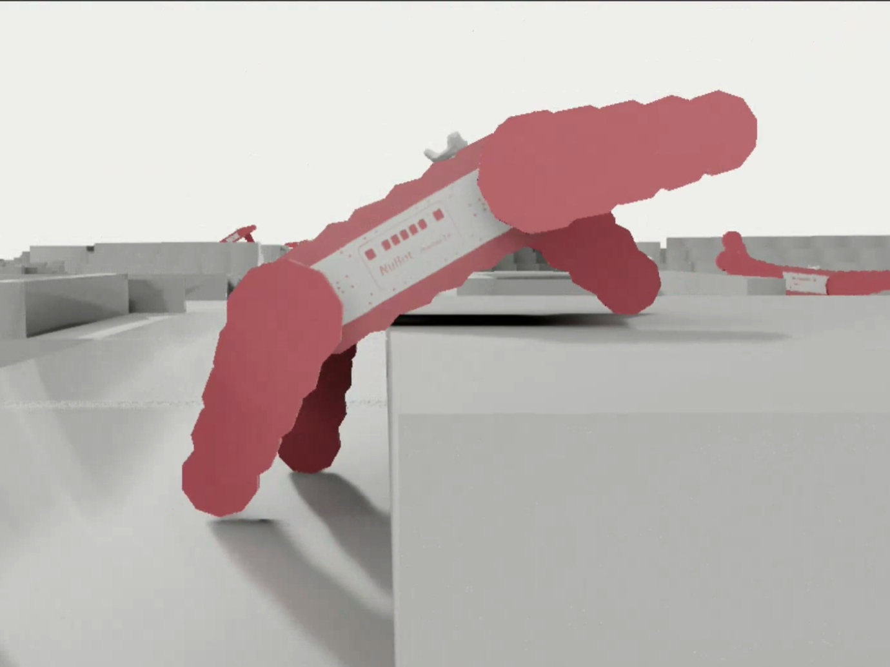
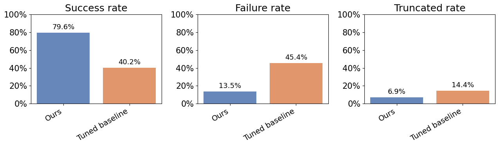
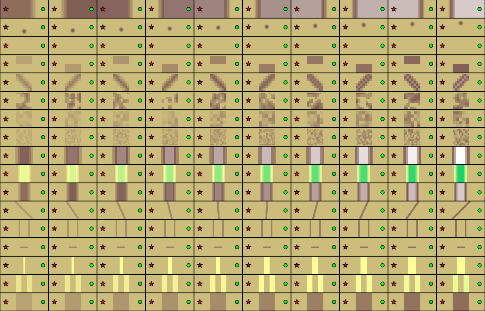
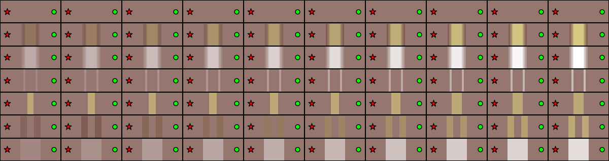
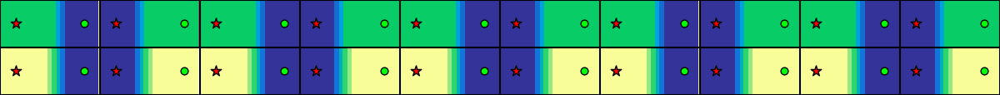
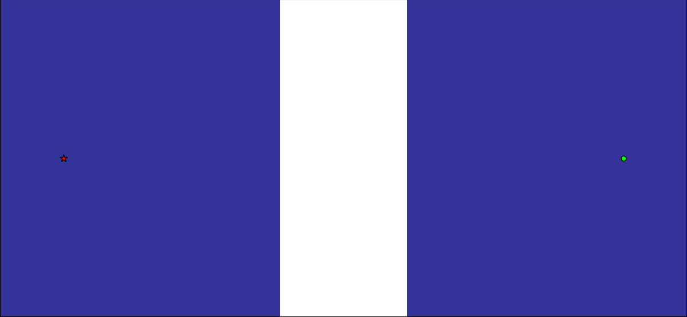

# MARV_RL

Reinforcement learning experiments for autonomous flipper control of the MARV tracked robot, trained in modified [FTR-Bench](github.com/pavelsarga/FTR-Benchmark) rigid-body simulator (IsaacLab / PhysX).

The trained policy controls all four flippers and the robot's velocity simultaneously, enabling autonomous traversal of unstructured terrain without operator input.

---

## Overview

| | |
|---|---|
|  |  |
| Parallel evaluation on the FTR-Bench Mixed terrain | Policy climbing a raised platform obstacle |

**Best policy result — `experiments/thesis/best_long`:**



> **Outdated claim (correction 2026-08-31):** the 79.6% vs 40.2% figure below comes from
> the pre-`rl_modules` training lineage (the `runs/TheAshape` / `runs/best_so_far` era) and is
> **not representative of the current policies**. Do not treat `TheAshape` or `best_so_far`
> naming as a recommendation — they are historical. The current deployable policy set lives in
> the workspace's `rl_baselines/` directory (one run dir per baseline; see
> `marv_flipper_control_research/VERSIONS_AND_TEST_PRIORITY.md` for what is compared and why);
> `rl_baselines/marv_rl` is the current reference PPO policy.

The RL policy achieved **79.6% success rate** across 16 terrain types, compared to **40.2%** for a optuna-tuned baseline (`experiments/thesis/random_policy_optuna`) — *pre-`rl_modules` lineage, see the correction above.*

---

## Repository structure

```
configs/        Training and Optuna hyperparameter configs (YAML), grouped by purpose:
  baselines/      One config per RL module (see "RL modules" below)
  optuna_best/    Best configs found by Optuna
  optuna/         Optuna study configs
  thesis_main/    Main thesis run configs
  variants/       One-off experiment variants
  random_policy/  Random-policy baseline eval configs
  templates/      Starting points for new configs
containers/     Apptainer definition + built .sif image
experiments/    Saved policy checkpoints (.pth) and evaluation results:
  baselines/      One dir per RL module — the baseline comparison runs
  thesis/         The main thesis runs (best_long, random_policy_optuna, ablations, …)
images/         Screenshots and evaluation plots
logs/           Run logs and checkpoints written by training/eval jobs (gitignored)
notebooks/      Analysis notebooks (Optuna, weight evolution, shock distribution, eval, …)
optuna/         Optuna study databases
scripts/        Training, evaluation, and utility shell/Python scripts
secrets/        W&B credentials (gitignored)
slurm/          SLURM batch scripts for HPC cluster jobs
src/
  flipper_training/   Core RL framework (PPO/SAC/D3QN/CREPS trainers, reward, environment)
  FTR-Benchmark/      FTR-Bench IsaacLab environments + rl_modules/ (submodule)
```

---

## RL modules

Observations and rewards are pluggable. `src/FTR-Benchmark/rl_modules/<name>/` owns a module's
full `get_observations()` / `get_reward_components()`; the environment just sums whatever
components the active module returns. The module is selected per-config via
`env_cfg_overrides.module_name`, resolved through `rl_modules/registry.py`.

Each module reproduces a different method, so each has its own trainer and evaluator:

| Module | Method | Config | Trainer |
|---|---|---|---|
| `marv_rl` | This project's own PPO policy (default) | `baselines/marv_config_marv_rl.yaml` | `train_ftr.py` |
| `hfc` | Hierarchical flipper control | `baselines/marv_config_hfc.yaml` | `train_ftr.py` |
| `mitriakov` | Mitriakov et al. 2021 | `baselines/marv_config_mitriakov.yaml` | `train_ftr.py` |
| `atd3qn` | Pan et al. 2023 AT-D3QN | `baselines/marv_config_atd3qn.yaml` | `train_d3qn.py` |
| `icmd3qn` | Pan et al. 2023 ICM-D3QN | `baselines/marv_config_icmd3qn.yaml` | `train_icmd3qn.py` |
| `creps` | Contextual REPS | `baselines/marv_config_creps.yaml` | `train_creps.py` |
| `ctrac` | Pan et al. 2025 C-TRAC (SAC + C-VAE) | `baselines/marv_config_ctrac.yaml` | `train_sac.py` |

> **`TRAIN_SCRIPT` must match the config's trainer.** Each trainer parses the YAML into a
> different, non-interchangeable dataclass, so pointing the wrong script at a config fails
> immediately at parse time (e.g. `FtrPPOConfig.__init__() got an unexpected keyword
> argument 'replay_buffer_capacity'`). The `slurm/train_<module>.sbatch` files already pair
> them correctly.

---

## Terrain generation

Courses are built by [`src/FTR-Bench-terrain-gen`](src/FTR-Bench-terrain-gen), a standalone
procedural generator (no Isaac Sim needed — just `usd-core`/`numpy`). From a single
`terrain_config.yaml` describing obstacle types, graded repeats and per-type min/max heights,
it emits everything `Terrain` expects: `usd/`, `map/`, `config/` and `birth/` for the named
terrain, plus a verbatim copy of the source config as `gen_config/<name>.yaml` and an SVG
heightmap preview in `plot/<name>.svg`.

```bash
python generate_terrain.py terrain_config_pecka_pallet.yaml \
    --output-dir ../FTR-Benchmark/ftr_envs/assets/terrain --overwrite
# --dry-run prints the layout + heightmap stats without writing anything
```

A training config then selects a course by name via its top-level `terrain:` field.

Each course is a grid: **rows are obstacle types, columns are repeats of increasing
difficulty.** The robot spawns at the red star and must reach the green dot, so every
environment in a batch is simultaneously running a different obstacle at a different
difficulty. `gen_config/<name>.yaml` is the single source of truth for that layout —
`env_type_registry.py` reads `rows`/`tile`/`repeats` straight out of it to label every
per-obstacle and per-difficulty breakdown, so regenerating a course with different rows
needs no code change.

| | |
|---|---|
|  |  |
| `custom_mixed` — 17 obstacle types × 10 difficulty steps, the main training course | `pan_symmetric` — 7 symmetric obstacle types, used for the Pan et al. baselines |
|  |  |
| `mitriakov_stairs` — two staircases, for the Mitriakov baseline | `pecka_pallet` — repeated pallet platform, for the CREPS baseline |

> ⚠ **`xformOp:orient` is w-first.** Identity in a terrain config is `[1.0, 0, 0, 0]`, never
> `[0, 0, 0, 1.0]` — `terrain.py` applies it via `Gf.Quatd(*value)`, which takes the real part
> first. The XYZW spelling of identity used by ROS and scipy reads back as a **180° rotation
> about Z**, mirroring the course while the heightmap, spawn points and row/column indices
> stay un-rotated — so the robot drives on a different obstacle than it spawns for and is
> scored against. Every generator-produced terrain is un-rotated; only the legacy `cur_*` set
> keeps the rotation deliberately (its heightmaps were authored in the rotated frame).
> `terrain.py` logs a warning on load if it sees the XYZW spelling.

---

## Setup

The training environment requires an NVIDIA GPU and the `isaaclab` conda environment.

```bash
# Clone with submodules
git clone --recurse-submodules git@github.com:pavelsarga/MARV_RL.git
cd MARV_RL
```

**Option A — conda (local)**
```bash
conda env create -f containers/environment.yml
conda activate isaaclab
```

**Option B — Apptainer/Singularity container (recommended for HPC)**

Build the container from the definition file (requires Apptainer ≥ 1.0):
```bash
apptainer build containers/isaaclab_optuna.sif containers/isaaclab.def
```
This pulls Miniconda, installs the conda environment, and bakes Isaac Lab v1.2.0 from source into the image. Build takes ~10–20 minutes depending on network speed.

Run a command inside the container:
```bash
apptainer exec --nv containers/isaaclab_optuna.sif python src/flipper_training/marv_rl_training/training/train_ftr.py --config configs/baselines/marv_config_marv_rl.yaml --headless

# Or use scripts that include the apptainer bind
bash scripts/train.sh --config configs/baselines/marv_config_marv_rl.yaml --headless
```
The `--nv` flag passes through the host NVIDIA GPU. On SLURM clusters the SLURM scripts handle this automatically.

Place your Weights & Biases API key in `secrets/wandb.env`:
```bash
echo "WANDB_API_KEY=your_key_here" > secrets/wandb.env
```

---

## Training

```bash
# Local training with the recommended config
CONFIG=baselines/marv_config_marv_rl.yaml bash scripts/train.sh

# Or on a SLURM cluster
sbatch slurm/train_marv_rl.sbatch
```

The config file is specified via the `CONFIG` environment variable. All configs live in `configs/`. The recommended starting point is `configs/baselines/marv_config_marv_rl.yaml` — the `marv_rl` module trained with PPO, which produced the results above.

Training logs and checkpoints are saved to `logs/<run_name>/`. W&B logging is enabled by default.

### Training a baseline module

`scripts/train.sh` defaults to `train_ftr.py` (PPO). For a module with a different trainer,
set `TRAIN_SCRIPT` to match (see the table above), or just use the module's SLURM script,
which already pairs them:

```bash
# Local — CONFIG and TRAIN_SCRIPT must correspond
CONFIG=baselines/marv_config_atd3qn.yaml TRAIN_SCRIPT=train_d3qn.py    bash scripts/train.sh
CONFIG=baselines/marv_config_ctrac.yaml  TRAIN_SCRIPT=train_sac.py     bash scripts/train.sh

# Short local smoke tests (few envs, no W&B) — use these to catch bugs before a full run
bash scripts/train_atd3qn_debug.sh
bash scripts/train_ctrac_debug.sh

# SLURM — one script per module, trainer already wired
sbatch slurm/train_atd3qn.sbatch
sbatch slurm/train_ctrac.sbatch
```

### C-TRAC: three-stage pipeline

`ctrac` is the one module that needs more than a single training run. Its C-VAE is
pretrained on a dataset collected by rolling out an already-trained `marv_rl` policy
through the C-TRAC-configured environment, before joint SAC + C-VAE training:

```bash
sbatch slurm/collect_ctrac_dataset.sbatch   # Stage 0 — needs a trained marv_rl checkpoint
sbatch slurm/pretrain_ctrac_cvae.sbatch     # Stage 1 — supervised only, no Isaac Sim
sbatch slurm/train_ctrac.sbatch             # Stage 2 — joint SAC + C-VAE
```

Each stage reads the previous stage's output path from its config, so the three configs
(`baselines/marv_config_ctrac_collect_dataset.yaml`, `..._cvae_pretrain.yaml`,
`marv_config_ctrac.yaml`) must stay pointed at each other. Relative paths resolve against
the workspace root, not the working directory.

---

## Hyperparameter search ([Optuna](https://doi.org/10.1145/3292500.3330701))

```bash
# Local Optuna run
bash scripts/run_ftr_training.sh

# SLURM Optuna run
sbatch --array=0-99%10 slurm/optuna_ftr.sbatch
```

The Optuna study database is stored in `optuna/optuna.db`. Analysis notebooks are in `notebooks/optuna_analysis.ipynb`.

---

## Evaluation

**Use `eval_auto.sh` — it picks the right evaluator for you.** It reads `module_name` out of
the run's saved `config.yaml` and dispatches to the matching script, so the same command
works for any module:

```bash
# Local — works for every module
bash scripts/eval_auto.sh experiments/thesis/best_long/attempt_0\
    --num_envs 256 --repeats 30\
    --output_dir logs/policy_eval\
    --eval_id best_long --headless # for visualization omit --headless

# Or on a SLURM cluster
sbatch slurm/eval_auto.sbatch experiments/thesis/best_long/attempt_0\
    --num_envs 256 --repeats 30\
    --eval_id best_long --headless
```

The evaluators are not interchangeable — each parses the saved config into its own dataclass,
so running the wrong one fails at parse time. `eval_auto.sh` exists to make that a non-issue:

| `module_name` | Dispatches to |
|---|---|
| `marv_rl`, `hfc`, `mitriakov` | `eval.sh` (PPO) |
| `atd3qn`, `icmd3qn` | `eval_d3qn.sh` |
| `creps` | `eval_creps.sh` |
| `ctrac` | `eval_sac.sh` |

`--weights {step|final|latest}` selects the checkpoint; omitting it prefers `policy_final.pth`
and falls back to the highest-numbered step checkpoint. Runs that hit a SLURM walltime often
have no `policy_final.pth`, so `--weights latest` is the useful option there.

With `--output_dir`, each eval also writes `eval_terrain.json` and copies the terrain's
generator config, heightmap preview, spawn points and config into `<output_dir>/terrain/`
before the first rollout, so results stay self-describing even if the job dies.

Saved runs live under `experiments/thesis/<name>/attempt_N/` (main thesis runs) and
`experiments/baselines/<module>/` (per-module baseline runs); either path works directly as
the `run_dir` argument above. Cross-run comparison is
in `notebooks/eval_analysis.ipynb`, which groups evals **by terrain** — environment type *N*
is a different obstacle on a different course, so evals on different terrains are never
merged into one comparison.

---

## Key configs

| Config | Description |
|--------|-------------|
| `baselines/marv_config_marv_rl.yaml` | **Recommended starting point** — the `marv_rl` PPO policy |
| `baselines/marv_config_<module>.yaml` | One per RL module — see the table above |
| `optuna_best/ftr_config_optuna_best_v4.yaml` | Best config from the Optuna study |
| `optuna/optuna_ftr_smooth.yaml` | Optuna study config |
| `random_policy/rand_policy_eval.yaml` | Random policy eval config |
| `templates/ftr_compat_config_template.yaml` | Starting point for a new config |

Config filenames encode lineage informally (e.g. `..._v4` = 4th iteration); check
`notebooks/optuna_analysis.ipynb` before assuming a given config is still the current best.

---

## Method summary

Describes the main `marv_rl` policy; the baseline modules each follow their own paper's method.

- **Algorithm:** [Proximal Policy Optimization (PPO)](https://arxiv.org/abs/1707.06347) with [Generalized Advantage Estimation (GAE)](https://arxiv.org/abs/1506.02438)
- **Simulator:** [FTR-Bench](github.com/pavelsarga/FTR-Benchmark) ([IsaacLab](https://isaac-sim.github.io/IsaacLab/main/index.html) / NVIDIA PhysX rigid-body)
- **Observations:** 45×21 robot-centric heightmap (processed by a CNN encoder) + linear/angular velocity, flipper positions, pitch/roll, goal vector
- **Actions:** Linear velocity, angular velocity, 4 independent flipper joint velocities
- **Reward:** Multi-component — goal progress, forward motion bonus, flipper action bonus, roll/pitch stability penalties, shock penalty, clearance penalty
